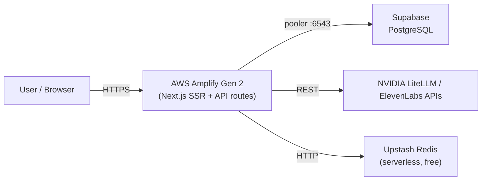

# LienRho — Deployment Plan (Supabase + AWS Amplify Gen 2)

> Simplified architecture after switching from #34 (Fargate/Aurora) to Supabase + Amplify.
> Ticket: [#30](https://github.com/Haise-727/LienRho/issues/30) | Supabase is kept as DB + auth.

## Architecture



**Why this instead of #34:** Amplify is dramatically simpler — no VPC, no Terraform, no ECS, no Aurora, no ElastiCache. Connects GitHub, auto-detects Next.js, builds & deploys on every push. Existing Supabase Auth (#25) stays intact.

## What we removed
| Old (#34) | New |
|---|---|
| `infra/` — 12 OpenTofu files | Deleted (orphaned resources already cleaned from AWS) |
| `Dockerfile` (Next.js standalone) | Deleted (Amplify handles build) |
| `frontend/next.config.ts` → `output:"standalone"` | Reverted (Amplify uses default Next.js output) |
| `.github/workflows/deploy.yml` (ECR+ECS) | Deleted (Amplify deploys on `git push`) |
| Aurora Serverless v2 | Supabase (unchanged) |
| ElastiCache Redis | Upstash Redis (serverless, 1 env var) |
| ALB + ECS Fargate | AWS Amplify Gen 2 (managed SSR) |
| NAT Gateway + VPC | Nothing — network managed by Amplify |

## What you need to do (one-time console setup)

### 1. AWS Amplify Console
1. Go to **AWS Amplify** → **Create new app** → **Host web app** → **GitHub**
2. Connect `Haise-727/LienRho`, select `main` branch
3. Amplify auto-detects `amplify.yml` at repo root → it's already there

### 2. Environment variables (set in Amplify console)
| Variable | Value |
|---|---|
| `DATABASE_URL` | `postgresql://...@aws-0-<pooler>.supabase.co:6543/lienrho?pgbouncer=true` |
| `DIRECT_URL` | `postgresql://...@aws-0-<db>.supabase.co:5432/lienrho` |
| `NEXT_PUBLIC_SUPABASE_URL` | Supabase project URL |
| `NEXT_PUBLIC_SUPABASE_ANON_KEY` | Supabase anon key |
| `NVIDIA_LITELLM_API_KEY` | Team key |
| `ELEVENLABS_API_KEY` | Team key |
| `UPSTASH_REDIS_URL` | `rediss://...` (from upstash.com → free tier) |

### 3. Upstash Redis
1. Go to **upstash.com** → sign up (free tier)
2. Create a Redis DB → copy the `UPSTASH_REDIS_URL`
3. Paste into Amplify env vars

## CI/CD flow
```
git push main
  → Amplify detects push
  → runs amplify.yml: npm ci → prisma generate → prisma migrate deploy → npm run build
  → deploys to https://main.xxxx.amplifyapp.com (auto-generated)
```

The existing `.github/workflows/ci.yml` still gates PR merges (lint, tsc, test, build). No manual `deploy.yml` needed.

## Files in this branch
| Path | Purpose |
|---|---|
| `amplify.yml` | Amplify build spec (install, generate, migrate, build) |
| `docs/15-aws-architecture.md` | This file |
| `frontend/next.config.ts` | Reverted to default (no standalone) |

## Migration (from local dev)
If you're running against **Supabase** locally:
1. Ensure your `.env` uses production Supabase URLs
2. `npx prisma migrate deploy` points `DIRECT_URL` to Supabase port 5432
3. First Amplify build runs this automatically

If you need seed data on the production Supabase: run `npx tsx prisma/seed.ts` once with production `DATABASE_URL` set.

## Status
- [x] AWS orphans cleaned (VPC, ALB, ElastiCache, ECR, NAT, IGW — all deleted)
- [x] Old IaC files removed (infra/, Dockerfile, deploy.yml)
- [x] `amplify.yml` created at repo root
- [ ] Connect repo to AWS Amplify console 
- [ ] Set env vars in Amplify
- [ ] Set up Upstash Redis
- [ ] First deploy — verify public URL