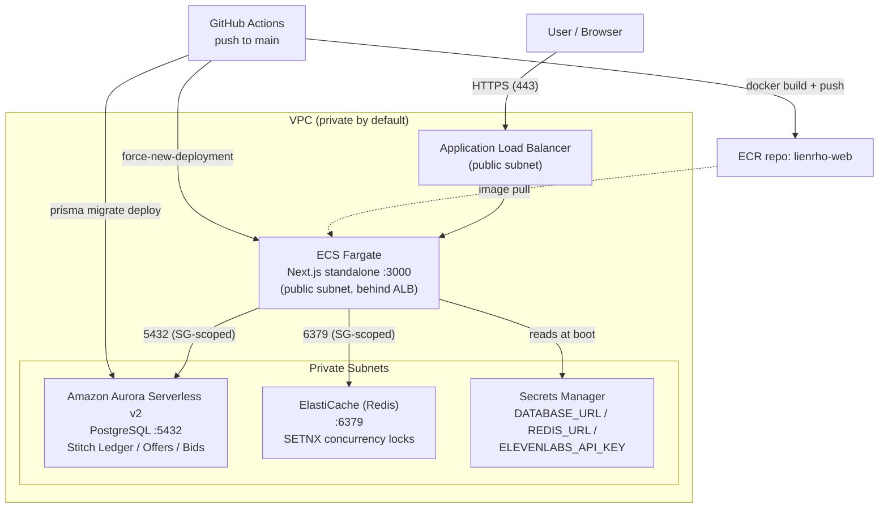
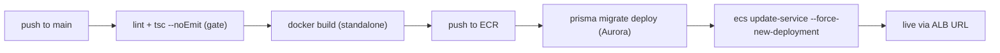

# LienRho — AWS Production Infrastructure (Issue #34)

> Planned architecture for moving LienRho from local dev → AWS production.
> Spec: `docs/aws_migration_plan.md` · Ticket: [#34](https://github.com/Haise-727/LienRho/issues/34)

## Architecture Diagram

## What each box is (plain English)

| Component | AWS service | Job |
|---|---|---|
| **ALB** | Application Load Balancer | The public HTTPS front door. Only thing users touch. |
| **ECS Fargate** | Serverless containers | Runs the Next.js app. No servers to babysit. Scales by task count. |
| **Aurora Serverless v2** | Managed PostgreSQL | The database. Scales to 0 when idle, up under load. |
| **ElastiCache** | Managed Redis | Distributed locks for the CodeCrafters Pareto matcher. |
| **Secrets Manager** | Secure config store | Holds DB/Redis/API keys — never baked into the image. |
| **ECR** | Container registry | Where the built Docker image lives. |
| **GitHub Actions** | CI/CD | On merge to `main`: build → push → migrate → redeploy. |

## Security model
- Aurora + ElastiCache live in **private subnets** → not publicly reachable.
- Security Groups only allow `5432`/`6379` traffic **from the Fargate SG**.
- Secrets injected at runtime from Secrets Manager, not in the repo or image.

## CI/CD flow (what happens on every `main` push)

## Open decisions (ask @Haise-727 / team)
1. **#34 (Fargate + Aurora) vs #30 (Amplify + Supabase)** — these contradict. #34 wins per the migration plan; close #30 or re-scope it.
2. **Region** — e.g. `ap-south-1` / `us-east-1`.
3. **Secrets** — Secrets Manager (recommended) vs SSM.
4. **Cost** — t4g.micro + Aurora Serverless v2 is a few $/day for the demo.
