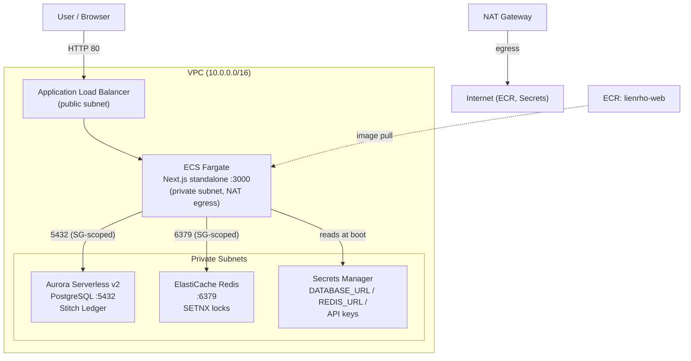
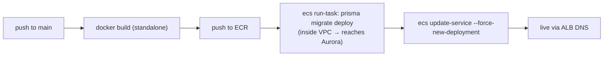

# LienRho — AWS Production Infrastructure (Issue #34)

> Implementation plan + status for deploying LienRho to AWS.
> Spec: `docs/aws_migration_plan.md` · Ticket: [#34](https://github.com/Haise-727/LienRho/issues/34)
> **Decision:** We are **ditching Supabase** entirely, so #34 (Fargate + Aurora) is the
> correct target. #30 (Amplify + Supabase) is invalid — it depends on Supabase Pooler + auth.

## Architecture

Security: Aurora + ElastiCache are private; only the Fargate SG can reach them.
Fargate has no public IP — it egresses via a single NAT Gateway.

## Files (this branch)

| Path | What |
|---|---|
| `infra/versions.tf` | OpenTofu + AWS provider (~> 5.83) config |
| `infra/variables.tf` | Region, CIDRs, DB name, API-key vars |
| `infra/vpc.tf` | VPC, 2 AZs, public/private subnets, IGW, NAT, route tables |
| `infra/ecr.tf` | ECR repo `lienrho-web` + lifecycle policy |
| `infra/aurora.tf` | Aurora Serverless v2 cluster + `db.serverless` instance |
| `infra/elasticache.tf` | Redis OSS `cache.t4g.micro` |
| `infra/iam.tf` | ECS execution + task IAM roles |
| `infra/secrets.tf` | Secrets Manager secret (DB/Redis/API URLs) |
| `infra/ecs.tf` | ECS cluster, ALB, target group, Fargate service, task defs (web + migrate) |
| `infra/outputs.tf` | ALB DNS, ECR URL, endpoints |
| `Dockerfile` | Multi-stage build of `frontend/` as Next.js standalone |
| `frontend/next.config.ts` | `output: "standalone"` enabled |
| `.github/workflows/deploy.yml` | Build → ECR → `prisma migrate deploy` (in-VPC) → Fargate redeploy |

## How it deploys (CI/CD)

Migrations run as a **one-shot Fargate task inside the VPC** so the private
Aurora is reachable — no need to expose the DB to the internet.

## Status
- [x] OpenTofu config written and `tofu validate` passes (40 resources planned).
- [ ] `tofu apply` (provisions real AWS — see cost note).
- [ ] `tofu output` → wire ALB DNS / secrets into GitHub repo secrets.
- [ ] Auth replacement for Supabase (Cognito recommended) — separate task.

## Cost note (hackathon)
NAT Gateway (~$32/mo) + Aurora Serverless v2 (scales to 0.5 ACU) + ElastiCache
t4g.micro + Fargate + ALB. Expect a few $/day while running; `tofu destroy`
after the demo to stop billing.
