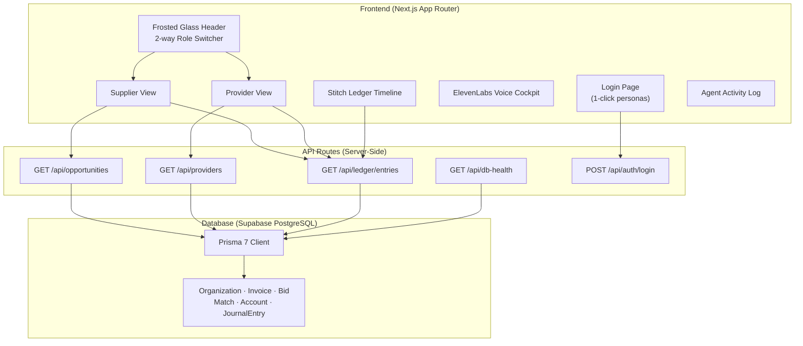

# Track 4 Implementation Plan v2 — Backend Integration & Role Alignment

## Goal Description

The v1 frontend was built with hardcoded USD mock data and a 3-way role model (`Supplier / Buyer / Capital Provider`). Your teammate Ragav has now pushed the real Prisma schema, seed data, and API routes to `dev`. This v2 plan integrates the frontend with the real backend, aligns the role model, and fixes the currency/data shape mismatches.

### What Changed in the Backend (Ragav's Track 1)

| Area | v1 Frontend (Mock) | Real Backend (Track 1) |
|:-----|:-------------------|:----------------------|
| **Roles** | 3-way: Supplier / Buyer / Provider | 2-way: `SUPPLIER` / `PROVIDER`. Buyers are passive `Customer` entities, not authenticated users. |
| **Currency** | USD (`$100,000`) | INR (`₹10,00,000`) |
| **Bid Fields** | `apr`, `speedDays`, `processingFeeRate` | `annualRate`, `settlementDays`, `flatFee`, `advanceRate` (all `Decimal`) |
| **Scoring** | Client-side Pareto function in `lib/scoring.ts` | Backend-computed: `netCashToSupplier`, `effectiveAnnualCost`, `utilityScore`, `rank`, `gateFailures[]` |
| **Urgency** | Self-reported slider (0–1) | **Derived** from `SupplierCashPosition` + `CashObligation[]`. Has `sufficiencyFloor`, `timingDeadline`, `drivingObligation`, `urgencyWeight`. |
| **Ledger** | Hardcoded mock table | Real double-entry engine: `/api/ledger/entries` with balanced postings |
| **Providers** | 3 mock names | 4 seeded: Meridian Bank, Kaveri Capital NBFC, Rapidfin (FinTech), Ashwin Credit Fund |
| **Opportunities** | 1 static invoice | 3 seeded: 1 live auction, 1 fully closed lifecycle, 1 unclearable (NO_ACCEPTABLE_OFFER) |

---

## User Review Required

> [!IMPORTANT]
> **Buyer View Removal:** The "Enterprise Buyer" tab in the role switcher will be **removed**. The backend treats buyers as passive counterparties (`Customer` model), not authenticated users. The 3-way pill becomes a 2-way pill: `[ Supplier Cockpit | Capital Provider ]`. The voice verification modal stays but is accessed from within the Supplier view as a "verify this invoice's buyer" action.

> [!IMPORTANT]
> **Currency Switch:** All `$` symbols and USD formatting will be replaced with `₹` and Indian number formatting (lakhs/crores via `toLocaleString("en-IN")`).

> [!WARNING]
> **Database Required:** After this integration, the dashboard will attempt to fetch from `/api/opportunities` and `/api/providers`. If the database is not running or not seeded, the UI will show a graceful "DB not connected" fallback banner instead of crashing. Your teammate's mock data continues to work as a safety net when the DB is offline.

---

## Open Questions

> [!IMPORTANT]
> **Supabase Connection:** Has Ragav shared the `DATABASE_URL` and `DIRECT_URL` with you? If not, the frontend will work in "mock fallback" mode until the `.env.local` is configured. Should I add the `.env.local` setup instructions to the plan?

---

## Proposed Changes

### Architecture Overview



---

### 1. Type Definitions & API Client Layer

#### [NEW] `frontend/src/lib/api-client.ts`
A typed fetch wrapper that calls the real backend API routes with graceful fallback to mock data when the DB is offline.

```typescript
// Checks /api/db-health first, then fetches real data or returns mock fallback
export async function fetchOpportunities(status?: string): Promise<OpportunitiesResponse>
export async function fetchProviders(): Promise<ProvidersResponse>
export async function fetchProviderSelf(providerId: string): Promise<ProviderSelfResponse>
export async function fetchLedgerEntries(opts?: { opportunityId?: string; eventType?: string }): Promise<LedgerEntriesResponse>
```

#### [MODIFY] `frontend/src/lib/scoring.ts`
- **Rename fields** to match backend: `apr` → `annualRate`, `speedDays` → `settlementDays`, `processingFeeRate` → `flatFee`
- **Add INR formatting**: `formatINR(paise: number)` and `formatDecimal(value: string)`
- **Keep the client-side Pareto function** but make it consume the backend's bid shape. When the backend has already computed `rank` and `utilityScore`, prefer those over client-side recalculation.
- **Gate failure display**: Parse `gateFailures[]` from backend bids and render them as red badges (e.g., "Fails Sufficiency Floor", "Fails Timing Deadline").

---

### 2. Role Model & Navigation (2-Way Switcher)

#### [MODIFY] `frontend/src/app/page.tsx`
- **Remove** the `"buyer"` role from `activeRole` state. Type becomes `"supplier" | "provider"`.
- **Remove** the Enterprise Buyer tab from the segmented pill switcher. Now 2 buttons.
- **Remove** the entire `{activeRole === "buyer" && (...)}` JSX block.
- **Move** the Voice Verification Modal trigger into the Supplier view (as a "Verify Buyer" action on each opportunity card).
- **Wire** data fetching: `useEffect` calls to `fetchOpportunities()` and `fetchProviders()` with loading/error states.

#### [MODIFY] `frontend/src/app/login/page.tsx`
- **Update 1-click personas** to match seeded organizations:
  - `Supplier: Vertex Components` (slug: `vertex-components`)
  - `Provider: Meridian Bank` (slug: `meridian-bank`)
  - `Provider: Rapidfin` (slug: `rapidfin`)
- **Remove** the "Buyer: Metro Retail" persona button (buyers don't log in).
- **Store** `orgType` and `orgSlug` in the session cookie response so the dashboard auto-selects the correct role tab.

#### [MODIFY] `frontend/src/app/api/auth/login/route.ts`
- **Return** `orgType` (`SUPPLIER` | `PROVIDER`) and `orgSlug` alongside the mock JWT token.
- **Map** demo emails to seeded org data:
  - `supplier@vertex.corp` → `{ orgType: "SUPPLIER", orgSlug: "vertex-components", displayName: "Vertex Components Pvt Ltd" }`
  - `bank@meridian.com` → `{ orgType: "PROVIDER", orgSlug: "meridian-bank", displayName: "Meridian Bank" }`

---

### 3. Supplier View — Real Data Integration

#### [MODIFY] `frontend/src/components/auction/BidTicker.tsx`
- **Accept** real bid objects from `/api/opportunities` response shape.
- **Map** `provider.archetype` (`BANK` | `NBFC` | `FINTECH` | `CREDIT_FUND`) to display badges.
- **Show** `gateFailures` as red warning badges on bids that fail the sufficiency floor or timing deadline.
- **Currency**: All amounts in `₹` with `toLocaleString("en-IN")`.

#### [MODIFY] `frontend/src/components/auction/UrgencySlider.tsx`
- **Pre-position** the slider at the backend-derived `urgencyWeight` value (from the opportunity's `cashPosition` derivation).
- **Display** the `drivingObligation` text (e.g., "September payroll + Kalyani Steel") and `sufficiencyFloor` amount.
- **Still allow** user override for demo purposes, but show the derived default prominently.

#### [MODIFY] `frontend/src/components/cards/DittoDealCard.tsx`
- **Replace** `netCashToday` / `totalCost` / `remainingDay90` with backend-computed fields:
  - `netCashToSupplier` (from `bid.netCashToSupplier`)
  - `effectiveAnnualCost` (from `bid.effectiveAnnualCost`)
  - `flatFee` (from `bid.flatFee`)
  - Reserve = `faceValue × (1 - advanceRate)`
- **Show** `gateFailures` as red disqualification badges.
- **Show** `recourse` status: "Non-Recourse ✓" (green) vs "With Recourse" (neutral).
- **Currency**: `₹` with Indian number formatting.

---

### 4. Provider View — Real Data Integration

#### [MODIFY] `frontend/src/components/provider/PortfolioGauge.tsx`
- **Fetch** real provider data from `/api/providers?self=<providerId>`.
- **Display** real fields: `totalLiquidity`, `availableLiquidity`, `costOfFunds`, `hurdleRate`, `riskAppetiteFloor`, `concentrationLimitPct`.
- **Show** active bids and escrow locks from the `self` response.
- **Replace** hardcoded sector exposure bars with real `sectorFocus` data.

---

### 5. Stitch Ledger — Real Data Integration

#### [MODIFY] `frontend/src/components/ledger/StitchLedgerTimeline.tsx`
- **Fetch** from `/api/ledger/entries?opportunityId=<id>` for deal-specific journal entries.
- **Render** real postings with `direction` (`DEBIT` / `CREDIT`), `account.code`, `account.type`, and `amount`.
- **Map** `eventType` to timeline steps: `OPENING_BALANCE` → Genesis, `DISBURSEMENT` → Day 0, `BUYER_PAYMENT` → Day 90, `RESERVE_RELEASE` → Settlement.
- **Show** the `totals.balanced` status indicator (green ✓ if balanced).
- **Currency**: `₹` formatting.

---

### 6. Graceful DB-Offline Fallback

#### [NEW] `frontend/src/components/ui/DbStatusBanner.tsx`
A dismissible banner that appears when `/api/db-health` returns non-200:
```
⚠️ Database not connected — showing demo data. Run `npx tsx prisma/seed.ts` to seed.
```
When DB is healthy and seeded, shows nothing. When degraded, shows the banner and the UI falls back to the existing mock data arrays.

---

### 7. Mock Data Preservation

#### [MODIFY] `frontend/src/lib/scoring.ts`
- **Keep** the existing mock bid arrays as `FALLBACK_BIDS` constant.
- **Export** them so `page.tsx` can use them when the API is unreachable.
- **Update** field names and currency to match the backend shape even in fallback mode.

---

## File Change Summary

| Action | File | What Changes |
|:-------|:-----|:-------------|
| **NEW** | `src/lib/api-client.ts` | Typed API fetch layer with DB-offline fallback |
| **NEW** | `src/components/ui/DbStatusBanner.tsx` | Graceful offline banner component |
| **MODIFY** | `src/app/page.tsx` | Remove buyer role, wire real API calls, INR currency |
| **MODIFY** | `src/app/login/page.tsx` | Update personas to match seeded orgs, remove buyer |
| **MODIFY** | `src/app/api/auth/login/route.ts` | Return `orgType` and `orgSlug` |
| **MODIFY** | `src/lib/scoring.ts` | Align field names with backend, add INR formatters |
| **MODIFY** | `src/components/auction/BidTicker.tsx` | Real bid shape, gate failures, INR |
| **MODIFY** | `src/components/auction/UrgencySlider.tsx` | Pre-position from derived urgencyWeight |
| **MODIFY** | `src/components/cards/DittoDealCard.tsx` | Backend-computed fields, recourse badge, INR |
| **MODIFY** | `src/components/provider/PortfolioGauge.tsx` | Real provider mandate data |
| **MODIFY** | `src/components/ledger/StitchLedgerTimeline.tsx` | Real journal entries from API |

---

## Verification Plan

### Automated Tests
```bash
cd frontend && npx tsc --noEmit   # Type-check all new interfaces
cd frontend && npm run lint        # ESLint clean (0 errors)
```

### Manual Verification

#### Without Database (Mock Fallback Mode)
1. Start `npm run dev` without `.env.local` configured.
2. Verify the DB status banner appears: "Database not connected — showing demo data."
3. Verify all components still render with mock INR data.
4. Toggle between Supplier and Provider views.

#### With Database (Full Integration)
1. Configure `.env.local` with Supabase connection strings.
2. Run `npx prisma db push && npx tsx prisma/seed.ts`.
3. Visit `http://localhost:3000/login` → click "Vertex Components" persona.
4. Verify Supplier view loads 3 real opportunities from the database.
5. Verify bids show `gateFailures` badges (Meridian Bank should show "Fails Sufficiency Floor").
6. Verify the urgency slider is pre-positioned at the derived `urgencyWeight`.
7. Click "Inspect Journal" on the Stitch Ledger → verify real double-entry postings appear.
8. Switch to Provider view → verify real liquidity and mandate data loads.
