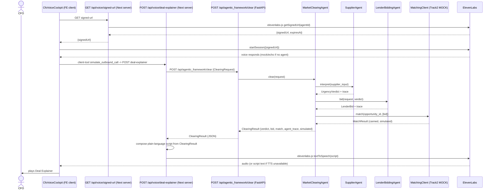

# Track 3 - ElevenLabs Voice AI & Agentic Framework Agents: Architecture / Design Plan

> Source: architect subagent pass over issue #3. Branch: track3/agentic_framework-agents (off dev).
> Decision log: ai/decisions.md

## 0. Design Principles (locked to repo conventions)
- Single source of truth for contracts: every agent I/O is a Pydantic model in
  ai/agentic_framework/schemas.py. FastAPI exposes these as response_models,
  flowing into openapi.json -> frontend/src/lib/api-types.ts (generator-driven) ->
  types.ts. Path to a future TS/Zod port with zero drift.
- Every agent = deterministic core + optional LLM, with enforced fallback (mirrors
  RuleBasedStrategist/LLMStrategist). With llm_enabled=False (default) the layer
  runs fully on rule-based logic. Acceptance "mock/echo OK" is the default.
- Audit by construction (mirrors ToolBox.trace): every agent run returns an
  immutable trace: list[str]; the supervisor persists a ClearingRun record to the
  existing durable audit store. No priced value is ever produced by an LLM -
  workers only interpret (urgency) or emit a mock bid; the clearing/match price
  comes from MatchingClient (Track 2 seam), never from a model.
- Decoupled from Tracks 1 & 4: consumes no Prisma/DB, no theme. Talks only to its
  own typed schemas and the MatchingClient seam. UI components use components/ui/*.

## 1. System Architecture Overview

```mermaid
flowchart TD
    subgraph FE["Frontend (Next.js) - no secrets here"]
        PAGE["Voice / Market page"]
        VC["CfoVoiceCockpit (client component) @elevenlabs/react + WebRTC simulator fallback"]
        BTN["Simulate Outbound Call button"]
    end
    subgraph FESRV["Next.js Server Routes (hold ElevenLabs secret)"]
        FV["GET /api/voice/signed-url (elevenlabs-js getSignedUrl)"]
        FD["POST /api/voice/deal-explainer (elevenlabs-js TTS)"]
        FN["POST /api/agentic_framework/clear (proxy)"]
    end
    subgraph BE["Python FastAPI Backend"]
        AN["/api/agentic_framework/* routers"]
        MCA["MarketClearingAgent (SUPERVISOR)"]
        SA["SupplierAgent (WORKER)"]
        LA["LenderBiddingAgent (WORKER)"]
        MC["MatchingClient (Track-2 SEAM)"]
        AUD["Audit store (reuse store.py)"]
        CFG["settings (typed, zero hardcode)"]
    end
    subgraph EXT["External"]
        EL["ElevenLabs API (ConvAI + TTS)"]
        T2["Track 2 Matching Engine (MOCK now, HTTP later)"]
    end
    PAGE --> VC
    PAGE --> BTN
    VC -->|client-tool: simulate_outbound| FD
    VC -->|startSession signedUrl| EL
    BTN --> FD
    FD -->|1. get ClearingResult| FN
    FN --> AN
    AN --> MCA
    MCA -->|call worker| SA
    SA -->|UrgencyVerdict + trace| MCA
    MCA -->|call worker| LA
    LA -->|LenderBid + trace| MCA
    MCA -->|match()| MC
    MC -->|canned MatchResult| MCA
    MCA -->|persist run| AUD
    MCA -->|ClearingResult| AN
    AN --> FN
    FD -->|2. compose script + TTS| EL
    FV -->|getSignedUrl| EL
```

## 2. Agent Responsibility Matrix

| Agent | Role | Input | Output | Rule-based fallback (no LLM) | LLM path (llm_enabled=True) |
|---|---|---|---|---|---|
| SupplierAgent | Worker - urgency | SupplierInput | UrgencyVerdict | Deterministic scoring from due-date proximity, cash need, credit days; emits fallback_reason when LLM absent | Same I/O; model only interprets narrative; never a money figure; falls through to rule-based on failure |
| LenderBiddingAgent | Worker - mock bid | LenderBidRequest (carries UrgencyVerdict) | LenderBid | Deterministic mock from fixed fee schedule keyed off urgency tier; simulated=True always at MVP | Optional LLM narrative only; numeric bid still from deterministic generator |
| MarketClearingAgent | Supervisor - orchestrate + clear | ClearingRequest | ClearingResult | Calls SupplierAgent, then LenderBiddingAgent, then MatchingClient.match; aggregates + full agent_trace | Coordinates same workers; may summarize rationale; match/price from MatchingClient |

System-prompt outlines live in ai/agentic_framework/prompts.py (beside impl).
Each agent returns its trace: list[str] (mirrors ToolBox.trace) so the supervisor
assembles ClearingResult.agent_trace and persists it.

## 3. Data & Control Flow



With no ElevenLabs key, FD returns the script text and the widget plays/echoes it
(acceptance "outbound TTS button works" satisfied in mock mode).

## 4. API Contract Specs

Conventions: JSON, camelCase over the wire (serialization_alias +
populate_by_name=True), all bodies validated by Pydantic.
agentic_require_auth: bool = False for MVP (standalone runnable); flip to True in
production to attach Depends(get_current_principal).

### 4.1 POST /api/agentic_framework/supplier/interpret
Request:
{ "supplierId":"SUP-001", "invoiceId":"INV-042", "invoiceAmount":120000.00,
  "dueDate":"2026-09-30", "creditDays":45, "cashNeed":90000.00,
  "currency":"INR", "notes":"Buyer delayed PO; payroll at risk" }
Response 200 -> UrgencyVerdict:
{ "urgencyLevel":"HIGH", "rationale":"Due in 9 days with 75% of receivables needed for payroll.",
  "confidence":0.82, "factors":["due in 9d","cashNeed/amount=0.75"],
  "fallbackReason":null, "trace":["SupplierAgent.interpret() -> rule-based"] }

### 4.2 POST /api/agentic_framework/lender/bid
Request LenderBidRequest (embeds the verdict):
{ "opportunityId":"OPP-007", "verdict": { ...UrgencyVerdict... },
  "advanceAmount":90000.00, "tenorDays":30, "riskTier":"B" }
Response 200 -> LenderBid:
{ "providerId":"MOCK-PROVIDER-1", "providerName":"Mock Capital Provider",
  "advanceRate":0.75, "apr":0.14, "feesBps":120, "disbursalLatencyHours":24,
  "tenorDays":30, "confidence":0.9, "fallbackReason":null, "simulated":true,
  "trace":["LenderBiddingAgent.bid() -> deterministic mock schedule"] }

### 4.3 POST /api/agentic_framework/clear (supervisor orchestration)
Request ClearingRequest:
{ "opportunityId":"OPP-007", "supplierInput": { ...SupplierInput... },
  "marketContext": { "maxApr":0.18, "minAdvanceRate":0.70 } }
Response 200 -> ClearingResult:
{ "opportunityId":"OPP-007", "supplierVerdict": { ...UrgencyVerdict... },
  "lenderBid": { ...LenderBid... },
  "match": { "matchId":"MOCK-MATCH-001", "matched":true, "matchedBidRef":"MOCK-PROVIDER-1",
             "score":0.91, "notes":"Canned match from MockMatchingClient" },
  "clearingSummary":"High-urgency request matched to a mock provider at 75% advance, 14% APR.",
  "agentTrace":["SupplierAgent...","LenderBiddingAgent...","MatchingClient.match() -> mock"],
  "simulated":true }

### 4.4 GET /api/voice/signed-url (Next.js server route, elevenlabs-js)
Response 200 -> SignedUrlResponse:
{ "signedUrl":"https://api.elevenlabs.io/.../convai/conversation/...",
  "agentId":"cf0...", "expiresAt":"2026-08-28T14:05:00Z", "simulated":false }
If voice_widget_mode == "simulator" (no key):
{ "signedUrl":null, "agentId":null, "expiresAt":null, "simulated":true }
and the widget uses the local echo simulator.

### 4.5 POST /api/voice/deal-explainer (Next.js server route, elevenlabs-js)
Request DealExplainerRequest:
{ "dealId":"OPP-007", "clearingRequest": { ...ClearingRequest... } }
Response 200 -> DealExplainerResponse:
{ "script":"Supplier ACME has a high-urgency request... matched to Mock Capital Provider at 75% advance, 14% APR.",
  "audioUrl":"/api/voice/audio/OPP-007.mp3", "simulated":true }

### 4.6 GET /api/agentic_framework/agents (A2A "Agent Card" seam)
Returns the three agent cards (id, role, input/output schema names, endpoint,
worker list). Hook for a future A2A/MCP wrapper to publish.

## 5. Module / File Layout

### Backend (Python FastAPI) - backend/app/
agents/agentic_framework/
  __init__.py            # exports get_* factories (mirror get_strategist)
  schemas.py             # ALL Pydantic contracts (single source of truth) [DONE in Step 1]
  agents.py              # SupplierAgent, LenderBiddingAgent, MarketClearingAgent (Step 2)
  matching_client.py     # MatchingClient ABC + Mock + Http stub (Step 3)
  prompts.py             # system prompts (beside impl) (Step 2)
  audit.py               # AgentTrace -> durable audit store (Step 5)
api/agentic_framework.py             # routers (Step 4)
config.py                # ADD: elevenlabs*, matching_client, agentic_require_auth, voice_widget_mode (Step 4)
main.py                  # app.include_router(agentic_framework_router) (Step 4)
tests/
  test_agentic_framework_schemas.py  # [DONE in Step 1]
  test_agentic_framework_agents.py   # (Step 2)
  test_agentic_framework_matching.py # (Step 3)

### Frontend (Next.js) - frontend/src/
app/api/
  voice/signed-url/route.ts     # server route -> elevenlabs-js getSignedUrl (Step 7)
  voice/deal-explainer/route.ts # server route -> /api/agentic_framework/clear + elevenlabs-js TTS (Step 7)
  agentic_framework/clear/route.ts          # proxy -> FastAPI (Step 6)
components/
  CfoVoiceCockpit.tsx           # @elevenlabs/react widget (Step 8)
  OutboundCallButton.tsx        # Simulate Outbound Verification Call (Step 8)
  DealExplainerPlayer.tsx       # plays audioUrl or renders script (Step 8)
lib/agentic_framework-types.ts              # re-export generated api-types for agentic_framework schemas

## 6. Integration Seams

Track 2 (Matching Engine) - MatchingClient swap (zero-change elsewhere):
  class MatchingClient(ABC):
      @abstractmethod
      def match(self, opportunity_id, bids) -> MatchResult: ...
  class MockMatchingClient(MatchingClient):  # default now
      returns canned MatchResult
  class HttpMatchingClient(MatchingClient):  # stub for later
      POST {matching_service_url}/match with tenacity timeout+retry (exp backoff+jitter)
  Selection: get_matching_client() reads settings.matching_client. Swapping Track 2 in =
  set matching_client=http + matching_service_url + implement HttpMatchingClient.

Track 4 (UI theme) - decoupled: voice components import only from components/ui/*;
no hardcoded colors/spacing; Track 4 wraps them.

Future TS / Option-A portability: Pydantic schemas = contract. FastAPI serializes
into openapi.json -> frontend types regenerated. For TS rewrite, each schema maps 1:1
to Zod; supervisor logic is plain Python calling typed functions, ports mechanically.
MatchingClient ABC is already the MCP-style tool boundary; a future A2A wrapper
publishes GET /api/agentic_framework/agents as Agent Cards and routes worker calls over A2A
without touching agent internals.

## 7. Security & Scalability Notes
- No secrets in the browser. ElevenLabs key only in Next.js server env; widget
  gets short-lived signedUrl. Python backend holds NO ElevenLabs secret (per D6 assumption).
- Typed payloads between agents; malformed worker output fails fast at boundary.
- No LLM-computed financial value (non-negotiable #1).
- Timeouts & retries on Track-2 call (HttpMatchingClient, tenacity). Mock = no network.
- Audit logging of agent calls (mirrors ToolBox.trace); simulated flag recorded (#6).
- Graceful degradation: every endpoint returns valid mock when keys absent.
- Stateless synchronous agents; MatchingClient seam lets Track 2 scale independently.
- Synthetic-data guard: mock bids/matches use clearly-labeled synthetic ids; simulated=true.

## 8. Build Order (smallest verifiable increments, standalone)
1. Schemas (DONE). 2. Agents + prompts. 3. Matching seam. 4. Backend routers + config.
5. Audit persistence. 6. Frontend proxy routes. 7. Voice server routes (gates on D6 A/B).
8. Voice UI components.

Each step independently runnable/testable; later steps do not block earlier ones.

